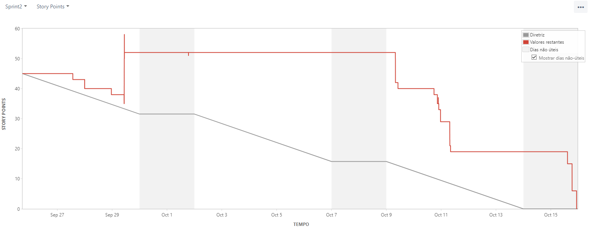

# Relatório 2º Sprint (Concluída)

## Entrega

- Para a Segunda Sprint entregamos como MVP todos os CRUDs do Projeto, também trabalhamos em outras telas essenciais como a tela relacionada a Educação, um requesito do cliente. Além disso também foi entregue a lógica necessária para converter e tratar os dados de um banco não relacional para um banco relacional, deixando pronto para a automatização do processo.

## Burndown da 2º Sprint.

