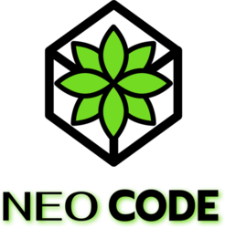

# API-4DSM

 

# NeoCode

- <a href ="#sobre"> Sobre o Projeto </a>
- <a href ="#repositorios"> Repositórios </a>
- <a href ="#escopo"> Escopo do Projeto </a>
- <a href ="#backlog"> Backlog Geral </a>
- <a href ="#relatorios"> Relatórios das Sprints </a>
- <a href ="#wireframes"> Mockups </a>
- <a href ="#modelagens"> Modelagens </a>
- <a href ="#manual"> Manual de Instalação </a>
- <a href ="#devops"> DevOps </a>
- <a href ="#equipe"> Equipe </a>

---

## Sobre o Projeto 

- O projeto consiste em desenvolver estações meteorológicas de baixo custo com sensores para monitorar a direção e velocidade do vento, índice pluviométrico, umidade, temperatura e pressão. Os dados coletados serão enviados para um servidor e exibidos em um portal com relatórios e dashboards. O objetivo é envolver alunos do ensino médio na aprendizagem baseada em problemas, usando o portal para demonstrar conceitos matemáticos e destacar a importância do monitoramento ambiental na prevenção de desastres naturais por meio da geração de alertas.

## Repositórios 

- Links para os Repositórios utilizados:  

1. Documentação: https://bitbucket.org/neocode2023/documentacao/src/main/ 
2. Frontend: https://bitbucket.org/neocode2023/frontend/src/main/  
3. Backend1: https://bitbucket.org/neocode2023/backend1/src/main/  
4. Backend2: https://bitbucket.org/neocode2023/backend2/src/main/  
5. Backend3: https://bitbucket.org/neocode2023/backend3/src/main/  
6. Sistema Embarcado: https://bitbucket.org/neocode2023/sistemaembarcado/src/master/  

## Escopo do Projeto 

- _Requisitos Funcionais_  

1. ([#RF1](https://neocode2023.atlassian.net/browse/NEOC-137)) Desenvolvimento de um datalogger para uma estação meteorológica.  
2. ([#RF2](https://neocode2023.atlassian.net/browse/NEOC-138)) Montagem de uma estação meteorológica.  
3. ([#RF3](https://neocode2023.atlassian.net/browse/NEOC-139)) Cadastro das estações, parâmetros e usuários.  
4. ([#RF4](https://neocode2023.atlassian.net/browse/NEOC-140)) Recepção dos dados das estações meteorológicas.  
5. ([#RF5](https://neocode2023.atlassian.net/browse/NEOC-141)) Criação de dashboards para visualização dos parâmetros meteorológicos.  
6. ([#RF6](https://neocode2023.atlassian.net/browse/NEOC-142)) Desenvolvimento de um tutorial para os alunos explicando o significado de cada parâmetro meteorológico.  
    

- _Requisitos Não Funcionais_  

1. ([#RNF1](https://neocode2023.atlassian.net/browse/NEOC-144)) Prezar pelo UX dos dashboards.  
2. ([#RNF2](https://neocode2023.atlassian.net/browse/NEOC-142)) Instigar nos alunos de ensino médio o gosto pelo estudo através da aprendizagem baseada em problemas.  
3. ([#RNF3](https://neocode2023.atlassian.net/browse/NEOC-145)) Documentações de rotas das APIs.  
4. ([#RNF4](https://neocode2023.atlassian.net/browse/NEOC-143)) Pipeline de IC.  
5. ([#RNF5](https://neocode2023.atlassian.net/browse/NEOC-143)) Deploy automático.  

## Backlog Geral 

Descrição                       | Prioridade | User Stories | Sprint | Status | 
 ------------------------------- | ------------ | ------------ | ------------ | ------------ |
Modelagem de Dados | Alta | Eu como cliente, desejo que seja feito um modelo de dados de todos os bancos que serão utilizados. | 1 | Concluído |
Arquitetura do Projeto | Alta | Eu como cliente, desejo que seja feita toda a arquitetura geral do projeto para melhor visualização. | 1 | Concluído |
Design do Projeto | Média | Eu como cliente, desejo ter acesso a um mockup das páginas do projeto. | 1 | Concluído |
Páginas de Cadastro, Atualizar, Ler e Deletar | Alta | Eu como cliente, desejo poder fazer todo o processo de um CRUD nas diversas areas do projeto (estações, parâmetros e alertas). | 2 | Concluído |
Relacionando os sensores com Educação | Baixa | Eu como cliente, desejo ter acesso a uma página que explique os conceitos básicos sobre as fórmulas utilizadas na estação. | 2 | Concluído | 
Envio dos dados de um Banco Não-Relacional para um Banco Relacional, com tratamento de Dados | Alta | Eu como cliente desejo que os dados sejam enviados para um banco relacional, após um tratamento severo de dados. | 2 | Concluído |
Portal com relatórios e dashboards das estações | Alta | Eu como cliente desejo ter acesso a uma dashboard de cada estação cadastro, com detalhes sobre a mesma. | 3 | Concluído |
Geração de Alertas quando um padrão pré-estabelecido for quebrado. | Média | Eu como cliente desejo poder controlar quais alertas pré-definidos foram quebrados após o recebimendo de certos dados. | 3 | Concluído |
Recebimento de Dados em um Banco Não Relacional | Alta | Eu como cliente desejo receber os dados da estação em um Banco Não-Relacional, e enviar a um relacional de tempos em tempos. | 3 | Concluído | 
Sistema de Login e Proteção | Alta | Eu como cliente desejo poder ter diferentes usuários cadastrados no sistema. | 4 | Concluído |
Consumir as informações do arduíno com os sensores funcionando | Alta | Eu como usuário cliente desejo que no final do projeto, o sistema esteja totalmente integrado com os sensores e a estação completa. | 4 | Em Desenvolvimento |

## Relatórios das Sprints 

- Relatório da 1º Sprint: ([Acessar Relatório](https://bitbucket.org/neocode2023/documentacao/src/main/docs/relatorios_sprints/sprint1.md))
- Video de apresentação da entrega da 1º Sprint: ([Acessar Video](https://www.youtube.com/watch?v=aQbrb0kELhA))

- Relatório da 2º Sprint: ([Acessar Relatório](https://bitbucket.org/neocode2023/documentacao/src/main/docs/relatorios_sprints/sprint2.md))

- Relatório da 3º Sprint: ([Acessar Relatório](https://bitbucket.org/neocode2023/documentacao/src/main/docs/relatorios_sprints/sprint3.md))

- Relatório da 4º Sprint: ([Acessar Relatório](https://bitbucket.org/neocode2023/documentacao/src/main/docs/relatorios_sprints/sprint4.md))

## Mockups 

- Protótipo Navegável: https://www.figma.com/proto/MpAfVlsEEXBxNlZnWvnAUi/Tecsus-Project?type=design&node-id=262-369&t=qXGjF7cC9Vk9x6zB-1&scaling=contain&page-id=229%3A546&starting-point-node-id=262%3A369&mode=design
- Mockups: ([Acessar Mockups](https://bitbucket.org/neocode2023/documentacao/src/main/docs/wireframe/wireframe.md))

## Modelagens 

- Modelagens: ([Acessar Modelagens](https://bitbucket.org/neocode2023/documentacao/src/main/docs/modelagem/modelagem.md))

## Manual de Instalação 

- Manual de instalação: ([Acessar Manual de Instalação](https://bitbucket.org/neocode2023/documentacao/src/main/docs/manuais/manual_instalacao.md))

## DevOps 

- O Link a seguir contém a documentação referente a implementação de DevOps no Projeto, contendo a descrição e detalhando um pouco do processo de cada metodologia e ferramenta utilizada. ([Acessar](https://bitbucket.org/neocode2023/documentacao/src/main/docs/devops/devops.md)) 

## Equipe 

| Membro                    | Funcão        | Github                                                                                                                                                  |
| ------------------------- | ------------- | ------------------------------------------------------------------------------------------------------------------------------------------------------- |
| Lucas França              | Product Owner | <a href="https://github.com/LucasFrancaRegistro"> |                                                                                                                                                                                
| Lucas Medici              | Scrum Master  | <a href="https://github.com/LucasMedici">         |
| Amanda Vieira de Oliveira | Dev Team      | <a href="https://github.com/Amandavo">            |
| Carlos Eduardo Falandes   | Dev Team      | <a href="https://github.com/Desduh">              |
| Guilherme Duarte          | Dev Team      | <a href="https://github.com/Guilhermedcdias">     |
| Júlia Sousa Gayotto       | Dev Team      | <a href="https://github.com/JuliaGayotto">        |
| Thiago Oliveira           | Dev Team      | <a href="https://github.com/ThiagoOAL">           |
| Kevin Ribeiro             | Dev Team      | <a href="https://github.com/KevinRomRib">         |
