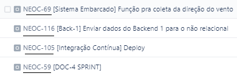
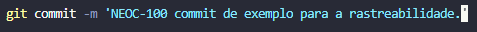
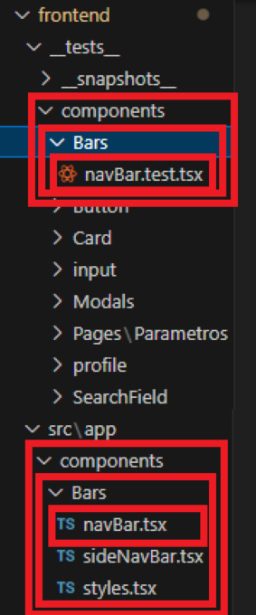
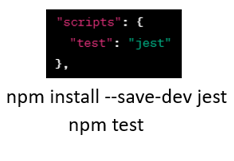
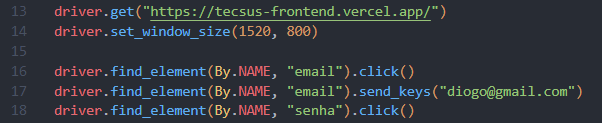

# DevOps

- <a href ="#rastreabilidade"> Rastreabilidade de Requesitos </a>
- <a href ="#branchs"> Estratégia de Branchs </a>
- <a href ="#integracaoContinua"> Integração Contínua (Esteira/Pipeline) </a>
- <a href ="#testesUnitarios"> Testes Unitários </a>
- <a href ="#testesIntegracao"> Testes de Integração </a>
- <a href ="#qa"> Garantia de Qualidade (Q/A) </a>
- <a href ="#deploy"> Deploy Automático </a>

---

## Rastreabilidade de Requisitos 

- A Rastreabilidade de Requisitos é um processo utilizados para registrar, gerenciar e acompanhar as tasks e os possíveis problemas que surgem durante o desenvolvimento de um projeto.

- O objetivo principal da Rastreabilidade de Requesitos é fornecer maneiras de organizar e priorizar tasks e problemas, permitindo que a equipe os rastreie de forma eficiente. Ajudando a garantir que nenhum problema seja ignorado.

- Para esse projeto todos os membros da equipe devem seguir um padrão de commit, cada tarefa inserida no Jira possui um ID próprio, que está linkado diretamente com um Epic, detalhando o requesito relacionado a respectiva tarefa. Além disso, esse ID também facilita a criação automática de branchs relacionadas a uma tarefa específica. Assim contribuindo para a Rastreabilidade de Requesitos.

- O padrão a ser seguido é colocar o Código da Tarefa antes de qualquer texto do commit, o código da Tarefa está descrito na respectiva tarefa dentro do Jira:  
 

 

- Após descobrir o código da tarefa, basta colocá-lo antes de qualquer texto do Commit:  
 

 

---

## Estratégia de Branchs 
 

 

---

## Integração Contínua 

A Integração Contínua (CI) é uma prática fundamental no ciclo de vida do desenvolvimento de software, e para alcançá-la eficientemente, nossa equipe utiliza as Pipelines do Bitbucket. Essa abordagem está implementada nos repositórios do BackEnd2, BackEnd3 e Front-end, fornecendo automação para testes de integração, qualidade e deploy. 

- As Pipelines Bitbucket foram integradas nos repositórios principais do BackEnd2, BackEnd3 e Front-end. Permitindo a execução automatizada de uma série de etapas essenciais no ciclo de desenvolvimento.
- Foram configuradas para executar testes de integração, testes unitários, testes de qualidade e podendo adicionar quaisquer outras verificações específicas definidas para cada projeto.
- Além dos testes, as Pipelines também gerenciam o processo de deploy. Isso significa que, após a conclusão bem-sucedida dos testes, o código é automaticamente implantado no ambiente apropriado. 
- Essa abordagem foi adotada para economiza tempo e reduz o risco de erros associados a implantações manuais.

---

## Testes Unitários 

Testes unitários permitem testar partes específicas do código de forma isolada, facilitando assim a detecção precoce de erros e contribuindo para a construção de um software mais robusto e confiável. 

Para executar os testes unitários, utilizamos a ferramenta Jest, uma estrutura de teste de código aberto para JavaScript. Foram executados testes unitários nos componentes do frontend e na conversão das medidas enviadas pelo Arduino, com o fator e o offset.

A estruturação das pastas nos testes é definida pela replicação da estrutura de pastas no app. Ao criar um arquivo de teste seguindo o padrão "nomeArquivo.test.tsx", este deve ser inserido nas mesmas pastas onde o arquivo se encontra no app em testes.

Como executar?

Os comandos para a execução dos testes (`npm i` e `npm test`) foram adicionados ao arquivo de pipeline, sendo assim a pipeline responsável pela realização dos testes unitários. 

---

## Testes de Integração 

O teste de integração tem como objetivo validar a interação adequada entre diversas partes de um sistema, garantindo a eficiente colaboração entre módulos, classes e subsistemas, ao mesmo tempo em que identifica possíveis problemas de integração.

Para realizar essa validação, utilizamos o Selenium WebDriver em conjunto com Python. Essa ferramenta é especializada em testes de interface de usuário, proporcionando automação que contribui para a melhoria contínua da qualidade do software. Ao integrar-se aos fluxos da pipeline do Bitbucket, o Selenium WebDriver possibilita a execução automatizada de testes a cada atualização ou nova versão do código. Esse processo assegura a detecção precoce de eventuais regressões ou problemas na experiência do usuário, promovendo assim a estabilidade e confiabilidade do sistema.

O teste foi realizado no arquivo "integrationTest.py", localizado no repositório do frontend, sendo executado dentro da pipeline. A seguir, apresenta-se uma seção de código em Selenium correspondente à execução.

---

## Garantia de Qualidade (Q/A) 

A Garantia de Qualidade (Quality Assurance - QA) refere-se à função de garantir a qualidade ao longo do ciclo de vida do desenvolvimento. Essa função envolve a verificação do cumprimento de critérios e métodos específicos durante os processos operacionais.

Nosso foco nessa parte foi realizar uma análise abrangente para identificar possíveis vulnerabilidades, erros e garantir a aderência a regras específicas de codificação. Este processo está alinhado com nossa política de Garantia de Qualidade (QA).

Como é realizada a análise?

A análise é conduzida por meio de ferramentas de análise estática de código, capazes de detectar vulnerabilidades de segurança, erros de sintaxe, questões de desempenho, código mal formatado, duplicações e outras violações das melhores práticas de codificação.

Para realizar essa análise, optamos por usar a ferramenta SonarCloud, um serviço em nuvem que se integra diretamente aos repositórios de código na plataforma Bitcucket através das pipelines criadas pelo CI/CD. A utilização do SonarCloud simplifica o processo, fornecendo uma análise detalhada do código-fonte em relação a padrões de qualidade, identificando áreas de melhoria e potenciais problemas de segurança. Segue abaixo como é realizada o processo da Garantia de Qualidade:

- O desenvolvedor realiza alterações no código, seja por meio de um novo commit ou abrindo um pull request.
- A ação do desenvolvedor aciona automaticamente a execução da pipeline integrada ao SonarCloud.
- A pipeline inicia a verificação do código utilizando o SonarCloud.
[ Imagem de exemplo ](https://bitbucket.org/neocode2023/documentacao/src/main/docs/imgs/ExecucaoPipeline.png)
- O SonarCloud analisa o código, verificando se atende aos critérios e métodos definidos para a qualidade do código.
- Após a conclusão da verificação no SonarCloud, a pipeline termina de ser executada.
- É enviado um email para o desenvolvedor informando o resultado da verificação.
- A notificação indica se houve falha nas verificações ou se o código atende aos critérios estabelecidos.
[ Imagem de exemplo ](https://bitbucket.org/neocode2023/documentacao/src/main/docs/imgs/NotificacaoPipeline.jpg)

---

## Deploy Automático 

O objetivo do deploy automatico é implementar uma estratégia de deploy eficiente e automatizada na AWS, ou em qualquer maquina linux. Primeiro, é necessário o preparo uma máquina virtual EC2, instalando Docker, Node.js, Python e configurando a segurança do firewall. Em seguida, contêinerizo a aplicação, criando Dockerfiles e docker-composes e armazenando as imagens no AWS ECR (em um cenário ideal). 
Por fim, implemento o Bitbucket Pipelines que é utilizado para CI, para adicionar como ultimo step o script para atualização dos arquivos do deploy e assim atualização do projeto em produção.Por ultimo configuro o Auto Scaling Group (ASG) para gerenciar a escalabilidade baseada no uso de CPU. 
Este processo visa otimizar a implantação e a operação da aplicação, garantindo eficiência e confiabilidade.

Especificações da Máquina de Produção Após deliberação, ficou acordado entre os presentes as seguintes especificações para a máquina de produção:

 -- Memória RAM: 32 GB
 
 -- Armazenamento: 40 GB
 
 -- Capacidade de Acesso: Suporte a 100 usuários simultâneos
 
Estas especificações foram definidas com o objetivo de garantir uma performance adequada e confiável para as necessidades do projeto.

Escalonamento de Recursos Foi também discutido e acordado que o escalonamento dos recursos da máquina ocorrerá quando atingida a marca de 60% da capacidade total de CPU. Esta medida visa garantir a eficiência e a estabilidade do sistema em momentos de alta demanda.

Especificações da Máquina de Desenvolvimento, ficou acordado entre os presentes as seguintes especificações para a máquina de produção:

 -- Memória RAM: 1 GB
 
 -- Armazenamento: 40 GB

Para mais detalhes do processo de deploy, temos um mapa conceitual demonstrando cada passo: https://whimsical.com/estrategia-de-deploy-na-aws-V8tMstnMak8wM24cjSqtgo
---
