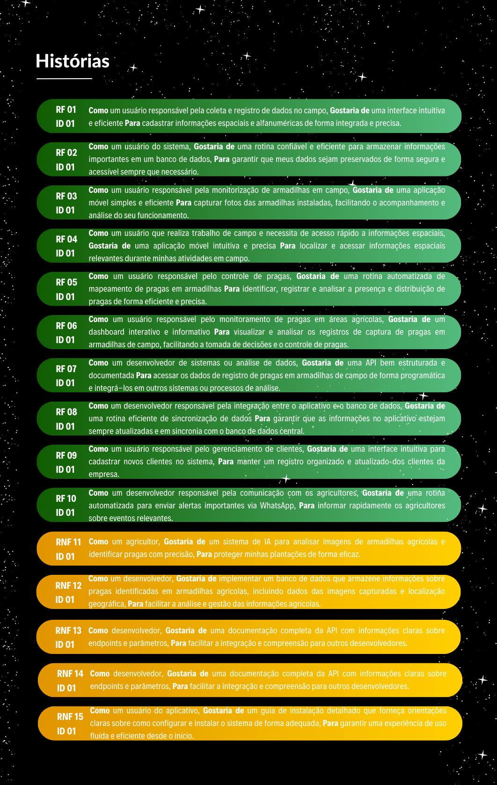

<h5 align="center"> Agro Vision | 5° DSM </h5>

 

 </h3>

      <h3 align="center"> Agro Vision </h3>

 
   <a href="#desafio">Desafio</a> •
   <a href ="#requisitos"> Requisitos </a> •
   <a href ="#planejamento"> Planejamento </a> •
   <a href="#sprints">Sprints</a> •
   <a href ="#tecnologias"> Tecnologias </a> •
   <a href ="#metodologia"> Metodologia </a> •
   <a href="#backlogs">Backlogs</a>

<h4 align="center"> 
 
 
 
</h4>

 

## :pencil2: Problema

Um dos principais problemas na agricultura brasileira é a quantificação de pragas em campo. Como
fonte alternativa, para essa finalidade, são realizadas análises humanas amostrais in loco ou
identificação do número de pragas encontradas em armadilhas de campo. O resultado da análise
gerada a partir destes métodos manuais provê um informativo quantitativo para tomada de decisão
como, onde e quando utilizar determinado defensivo agrícola. Como a agricultura brasileira vem se
modernizando e necessita da redução de custos fixos, vemos um apelo para entrada de tecnologia
para diminuição de atividade humana em campo para análise de pragas em campo, por exemplo. 

 

## :rocket: Solução

Temos como solução o desenvolvimento de um APP mobile que permita:
- (1) a localização de uma armadilha em campo (GPS);
- (2) a coleta de uma foto desta armadilha que contenha ou não pragas;
- (3) o sincronismo desta foto coletada, em nuvem;
- (4) o processamento desta foto em quantitativos:
- (4.1) Número de pixels da armadilha que contenham pragas;
- (4.2) Número de pixels da armadilha que não contenham pragas;
- (4.3) Alocação (quantidade) de praga por célula da armadilha;
- (5) montagem de dashboards por armadilha monitorada no front end da aplicação; e
- (6) modelagem de API para conexão destes arquivos Jsons em outros BIs.

 

## :milky_way: Desafio

Aplicação mobile para registro e quantificação de pragas em campos agrícolas

 

## :dart: Requisitos do Projeto

**📌 Requisitos Funcionais**
- Desenvolvimento de uma interface para cadastro de informações espaciais e alfanuméricas de campo;
- Desenvolver rotina para armazenamento de informação em banco de dados;
- Desenvolver aplicação para obtenção de fotos de armadilhas em campo;
- Desenvolver aplicação para localização de informações espaciais, em campo;
- Desenvolver rotina para mapeamento (IA) de pragas nas armadilhas;
- Desenvolver Dashboard de indicadores de registro de pragas em armadilhas de campo;
- Desenvolver API para consumo dos dados produzidos;
- Desenvolver rotina para sincronismo de dados do APP com banco de dados;
- Desenvolver uma interface de cadastro cliente;
- Desenvolver rotina para envio de alertas ao WhatsApp do agricultor.
  
**📌 Requisitos Não Funcionais**
- Modelo treinado e desenvolvido para o mapeamento das pragas em armadilhas;
- Modelagem de Banco de Dados ou Arquivo de dados;
- Documentação API – Application Programming Interface;
- Manual do Usuário;
- Guia de instalação.

 

## :hourglass_flowing_sand: Planejamento de Entregas

- [x] [Kickoff](#) - 04/03/2024 até 08/03/2024

- [x] [SPRINT 1](#) - 25/03/2024 até 14/04/2024

- [x] [SPRINT 2](#) - 15/04/2024 até 05/05/2024

- [x] [SPRINT 3](#) - 06/05/2024 até 26/05/2024

- [x] [SPRINT 4](#) - 27/05/2024 até 16/06/2024

 

**:link: Clique no link abaixo para visualizar o *Trello* das atividades da equipe:**
> [Trello](https://trello.com/b/QyOUlOmO/visiona-agro-vision)

 

## :date: Sprints

🔖 SPRINT 1 ([Sprint Link](doc/sprints/sprint1.md)): Concluído ✔️

🔖 SPRINT 2 ([Sprint Link](doc/sprints/sprint2.md)): Concluído ✔️

🔖 SPRINT 3: ([Sprint Link](doc/sprints/sprint3.md)): Concluído ✔️

🔖 SPRINT 4: ([Sprint Link](doc/sprints/sprint4.md)): Concluído ✔️

 

## :joystick: Tecnologias Usadas

* **Banco de dados:** MySQL
* **Backend:** JavaScript
* **Front-end:** React Native
* **Ferramentas:** Visual Studio Code, GitHub.

 

## :bulb: Metodologia Usada

* **Metodologia Ágil:** Framework [Scrum](https://www.scrum.org/)

 

## :crystal_ball: Product e Sprint Backlog

<h1 align="center"> </h1>

## :flying_saucer: Épicos e User Stories

<h1 align="center"> </h1>
<h1 align="center"> </h1>

 
