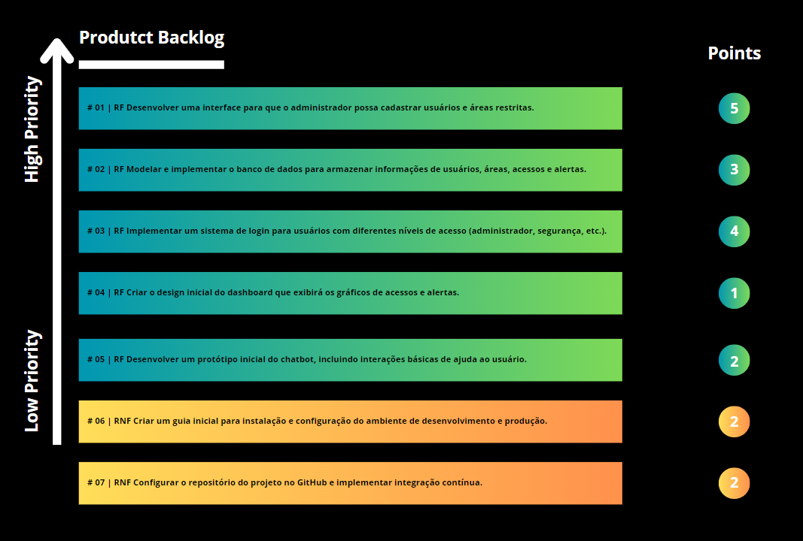
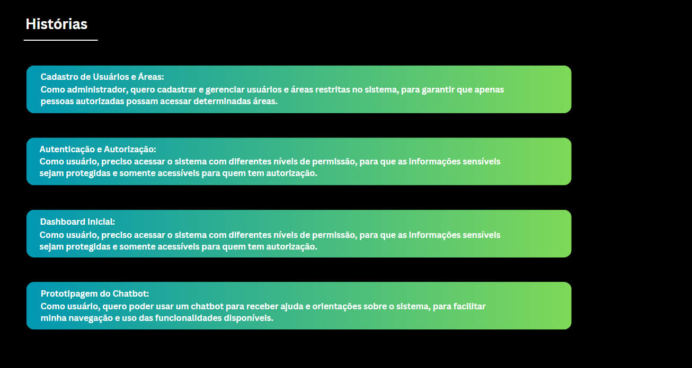

<h5 align="center"> WhatsCode | 6° DSM </h5>

 

 </h3>

      <h3 align="center"> WhatsCode </h3>

 
   <a href="#desafio">Desafio</a> •
   <a href ="#requisitos"> Requisitos </a> •
   <a href ="#planejamento"> Planejamento </a> •
   <a href="#sprints">Sprints</a> •
   <a href ="#tecnologias"> Tecnologias </a> •
   <a href ="#instalacao_utilizacao"> Instalação e Utilização </a> •
   <a href ="#metodologia"> Metodologia </a> •
   <a href="#backlogs">Backlogs</a>

<h4 align="center"> 
 
 
  
 
 
</h4>

 

## :pencil2: Problema

Um dos principais problemas na gestão de segurança é o controle ineficiente de travas de portas. Atualmente, muitos sistemas utilizam chaves físicas ou cartões magnéticos, que podem ser facilmente perdidos, duplicados ou comprometidos. Esses métodos manuais e semi-automatizados não oferecem um controle de acesso robusto e são difíceis de gerenciar, especialmente em grandes instalações. Com a crescente necessidade de segurança e eficiência operacional, há um apelo para a implementação de soluções tecnológicas que automatizem o gerenciamento de travas de portas, proporcionando maior segurança, rastreabilidade e flexibilidade.

 

## :rocket: Solução
Temos como solução o desenvolvimento de um aplicação web com: 
- (1) Controle Centralizado: Um painel de administração intuitivo para gerenciar todas as travas e portas de forma centralizada.
- (2) Cadastro e Configuração: A adição e configuração de novas travas e dispositivos de controle, com definição de permissões de acesso para diferentes usuários.
- (3) Monitoramento e Registro: Registro automático de eventos de acesso, incluindo tentativas de abertura e alterações de configuração, com geração de relatórios detalhados.
- (4) Controle de Acesso Dinâmico: Capacidade para ajustar e atualizar permissões de acesso em tempo real, possibilitando a inclusão ou exclusão de usuários e a alteração de níveis de acesso.
- (5) Integração com Dispositivos: Integração com dispositivos de controle de acesso físico, como fechaduras eletrônicas e leitores de cartões, através de APIs.
- (6) Segurança Avançada: Implementação de autenticação multifator e criptografia de dados para garantir a segurança e integridade das informações.
 

## :milky_way: Desafio

Aplicação web para registro e monitoramentos de travas de portas
 

## :dart: Requisitos do Projeto

**📌 Requisitos Funcionais**
- Desenvolver uma interface para que o administrador possa cadastrar usuários e áreas restritas;
- Modelar e implementar o banco de dados para armazenar informações de usuários, áreas, acessos e alertas.
- Implementar um sistema de login para usuários com diferentes níveis de acesso (administrador, segurança, etc.);
- Criar o design inicial do dashboard que exibirá os gráficos de acessos e alertas;
- Desenvolver um protótipo inicial do chatbot;
  
**📌 Requisitos Não Funcionais**
- Criar um guia inicial para instalação e configuração do ambiente de desenvolvimento e produção;
- Configurar o repositório do projeto no GitHub e implementar integração contínua;
  
 

## :hourglass_flowing_sand: Planejamento de Entregas

- [x] [Kickoff](#) - 02/09/2024 até 06/09/2024

- [x] [SPRINT 1](#) - 09/09/2024 até 29/09/2024

- [x] [SPRINT 2](#) - 07/10/2024 até 27/10/2024

- [x] [SPRINT 3](#) - 04/11/2024 até 24/11/2024

 

## :date: Sprints

🔖 SPRINT 1 ([Sprint Link](doc/sprints/sprint1.md)): Concluída 
 
🔖 SPRINT 2 ([Sprint Link](doc/sprints/sprint2.md)): Concluída 
 
🔖 SPRINT 3 ([Sprint Link](doc/sprints/sprint3.md)): Concluída 
 

## :file_folder: Repositórios

🔖 FrontEnd ([Link](https://github.com/WhatsCode-24/front))
 
🔖 BackEnd ([Link](https://github.com/WhatsCode-24/backend))
 
🔖 ChatBot ([Link](https://github.com/WhatsCode-24/chatbot))
 

## :joystick: Tecnologias Usadas

* **Front-end:** ReactJS
* **Backend:** NodeJs
* **Banco de dados:** MySQL

 

 

## :bulb: Instalação e Utilização

* **Manual de Instalação:** [Instalação](https://github.com/WhatsCode-24/documentacao/blob/main/doc/guia-instalacao/README.md)
* **Manual de Utilização:** [Utilização](https://github.com/WhatsCode-24/documentacao/blob/main/doc/utilizacao/utilizacao.md)

 

 
## :bulb: Metodologia Utilizada

 **Metodologia Ágil:** Framework [Scrum](https://www.scrum.org/)

 

## :crystal_ball: Product Backlog

<h1 align="center">  </h1>

## :flying_saucer: Épicos e User Stories

<h1 align="center"> </h1>

 
