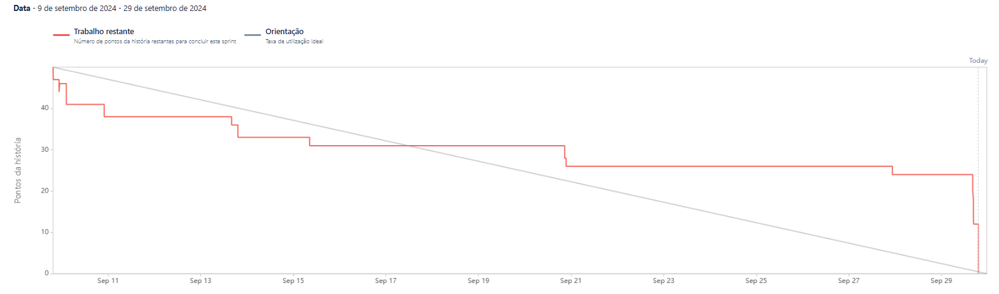

# Sprint 1 - Relatório

## Objetivos da Sprint

Nesta primeira sprint, focamos no desenvolvimento das funcionalidades principais do backend, além de iniciar a estruturação do frontend e o estudo da implementação do chat bot.

### Funcionalidades Desenvolvidas:

- **CRUD de Usuários:** Implementação completa das funcionalidades de criação, leitura, atualização e exclusão para os usuários.
- **CRUD de Empresas:** Finalizado o CRUD das empresas, permitindo o gerenciamento de informações como nome, telefone, e localidade.
- **CRUD de Áreas/Comodos:** Desenvolvemos as funcionalidades para gerenciamento de áreas e cômodos.
- **Frontend:** Início da implementação do frontend, com a base da interface já estruturada.
- **Estudo do Chat Bot:** Iniciamos o estudo e planejamento da implementação do chat bot no sistema.

## Progresso da Sprint

Abaixo está o burndown chart para acompanhamento das atividades da sprint:

---

**Conclusão:** Concluímos grande parte das funcionalidades de backend previstas, além de já termos uma base inicial para o frontend. Continuaremos aprimorando o sistema e avançando com o chat bot nas próximas sprints.
