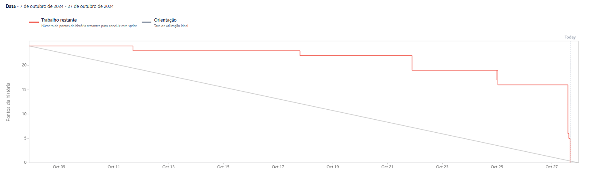

# Sprint 2 - Relatório

## Objetivos da Sprint

Na segunda sprint, decidimos junto ao cliente focar no desenvolvimento da DASHBOARD contendo informações sobre acessos de pessoas em determinadas áreas, assim
como também desenvolvemos a funcionalidade para exibir um video quando esse acesso acontecer.

### Funcionalidades Desenvolvidas:

- **Dashboard:** 
- **Controle de Acessos:**
- **Admin/Usuario:** 

## Progresso da Sprint

Abaixo está o burndown chart para acompanhamento das atividades da sprint:

---

