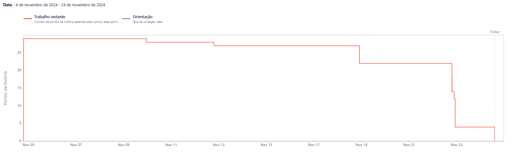

# Sprint 3 - Relatório

## Objetivos da Sprint

Na terceira e última sprint focamos na integração do ChatBot com o Sistema, desenvolvendo uma tela de uso e integração ao back-end,
além disso também aproveitamos para corrigir alguns Bugs e implementar feedbacks das ultimas entregas. Também subimos nosso serviço
para a nuvem.

### Funcionalidades Desenvolvidas:

- **ChatBot Integrado** 
- **Correção de Bugs**
- **Serviço na Nuvem** 

## Progresso da Sprint

Abaixo está o burndown chart para acompanhamento das atividades da sprint:

---
